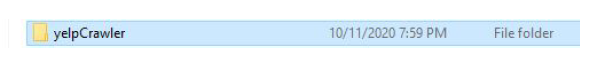

# yelpCrawler-archive

This yelpCrawler is a stand-alone executable python program/file for crawl data from the whole
Stockholm county. I developed this tool at 2020 and the purpose is to enable everyone in the research team could contribute crawling data even though they can't use python at all. The instruction below is also for laymen users.

**You don’t have to have python installed or learn how to use python.**

This program currently only can be run on the Windows system. If you use OS X or Linux,
please remotely use the windows PC in our campus library.
We have 10200 cell and central points in the whole Stockholm county to be crawled. Due to the
5000 times request limitation per account per day in yelp , we need 44 account to crawl all
the data if we only have one day. For the same reason, if all the people in Leam could help. We
could crawl all the data within three days.
Now we evenly divide all the central points into 44 csv files. U can type you API-KEY and the
csv file index into this program, and just wait, to get the data response.

---
## Usage 

### 1, Download and Install/Unzip
There are two ways to install this program into your computer:
1）Download the .zip file, and unzip it to any folder you would like on your computer.
2）Download the .exe file, and install it to any folder you would like on your computer. If
there is any virus warning, please ignore them. Just install it.

### 2, Find the correct .exe file.
After Unzip/Installation, you will see this folder, and please open it.

Then, please open this “Dist” folder.

Then, please open “yelpCrawler” folder

Then double click “yelpCrawler.exe” to run it.

### 3 Run it. Type your own API KEY and the number of stockholm csv file.

Please copy and past you API Key to the command line window, and press “Enter”.

And type the Zone Index, which is the number of the CSV file you are responsible to crawl.

If you start crawling data successfully, you will see the a new csv file with a suffix “_businesses”
showing up.

### 4, Please keep an eye on the number of your remaining API call

You need to make sure your remain API calls is over 4900 before you start using this program
because the for each central point CSV file requires around 4800-4900 request to finish all the
crawling. If your remaining API calls are less than 4900, please wait until the next day when you
have a new 5000 remaining calls, or register a new yelp account.